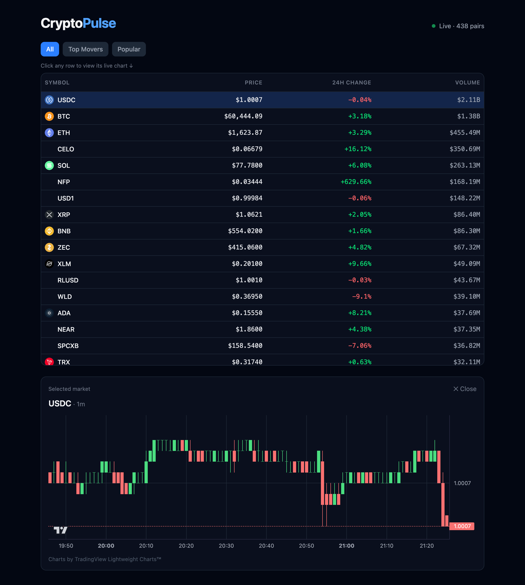

# CryptoPulse

A real-time cryptocurrency dashboard that renders **hundreds of live trading pairs at 60fps** in the browser, streaming market data from Binance's public WebSocket feed. Built as a full-stack **front-end performance engineering** case study: React/TypeScript frontend, ASP.NET Core + SignalR backend, containerized with Docker and deployed to the cloud.

**🔗 Live demo:** https://cryptopulse-frontend-gy4g.onrender.com
*(Free-tier hosting — the backend may take ~30–50s to wake up on the first request.)*



---

## What it does

- Streams **~440 live USDT trading pairs**, each updating multiple times per second, in a virtualized table that stays smooth.
- Click any row to open a **live candlestick chart** (1-minute klines) for that pair.
- Three views: **All**, **Top Movers** (largest 24h moves), and **Popular** (curated majors), with client-side sorting by USD quote volume.
- Live connection status with automatic reconnect (SignalR).

---

## Why this project

Crypto market data is a naturally **high-frequency, high-volume** workload: hundreds of pairs, each updating several times a second. A naive React implementation collapses under this load because every incoming message re-renders the entire table. This project is about making that fast — and **measuring the difference**.

The headline isn't "I can call an API." It's **"I can keep a high-frequency, data-heavy UI at 60fps, and I can prove it with numbers."**

---

## Performance results

All numbers measured with the React DevTools Profiler and Chrome DevTools Performance panel, rendering ~440 live pairs updating every second.

| Metric | Before | After | Improvement |
|---|---|---|---|
| Single commit render time | **57.5 ms** | **7.5 ms** | **~7.7× faster** |
| What re-renders per update | Entire `App` (all rows) | Only rows whose data changed | — |
| Scripting time (main thread, ~13s trace) | ~503 ms | ~410 ms | ~18% less |

At 60fps, the browser has a **16.7 ms** budget per frame. The naive version blew past it at 57.5 ms (dropping frames on every update); the optimized version fits comfortably under budget.

**Before — one update re-renders the whole app (57.5 ms):**


**After — only changed rows re-render (7.5 ms):**


---

## How the performance was achieved

Three techniques, layered:

1. **Row virtualization** ([TanStack Virtual](https://tanstack.com/virtual)) — only the rows visible in the viewport are mounted in the DOM. Whether the list has 400 rows or 4,000, the DOM node count stays constant (~30–40 rows). The visible window is computed from `scrollTop ÷ rowHeight`, so scrolling never mounts the full list.

2. **Memoized row components** (`React.memo`) — each row is an isolated component that only re-renders when *its own* data changes. Combined with a symbol-keyed `Map` merge on incoming data, rows whose price didn't tick keep their previous object reference and are skipped entirely. This is what took a single commit from 57.5 ms → 7.5 ms.

3. **requestAnimationFrame batching** — incoming SignalR messages are staged in a ref (which doesn't trigger renders) and flushed into React state at most **once per frame** via a persistent rAF loop. No matter how many messages arrive between frames, the UI commits once, capping render frequency at the screen's refresh rate.

A notable debugging story from the build: React 18 **StrictMode double-mounts** effects in development, which caused duplicate SignalR connections that overwrote each other's state (the pair count kept resetting to 0). Fixed by deferring connection start and guarding the effect so only the surviving mount connects — the app runs correctly under StrictMode.

---

## Architecture

```
┌────────────────────────────────────────────────────────────┐
│  Browser (React + TypeScript)                               │
│  ┌──────────────────────┐   ┌──────────────────────────┐   │
│  │ Virtualized table     │   │ Candlestick chart         │   │
│  │ (TanStack Virtual)     │   │ (lightweight-charts)      │   │
│  └──────────────────────┘   └──────────────────────────┘   │
│            ▲ rAF-batched state updates                      │
│            │ SignalR (WebSocket)                            │
└────────────┼───────────────────────────────────────────────┘
             │
┌────────────┴───────────────────────────────────────────────┐
│  ASP.NET Core backend                                       │
│  • Background service holds one WebSocket to Binance         │
│  • Parses + reshapes ticks, broadcasts via SignalR hub       │
│  • Fans out one upstream connection to N browsers            │
└────────────┬───────────────────────────────────────────────┘
             │ Binance public WebSocket (no API key required)
┌────────────┴───────────────────────────────────────────────┐
│  Binance Market Streams                                     │
│  • !miniTicker@arr   → all-market 24h tickers (~1/sec)       │
│  • <symbol>@kline_1m → klines for the selected pair          │
└────────────────────────────────────────────────────────────┘
```

**Why a backend at all?** The browser *could* connect to Binance directly, but the .NET layer earns its place: it **fans out** a single upstream connection to many clients instead of every browser hitting Binance, and it isolates third-party reconnect/rate-limit concerns behind a stable SignalR hub.

---

## Tech stack

**Frontend:** React, TypeScript, Vite, TanStack Virtual, [lightweight-charts](https://github.com/tradingview/lightweight-charts) (TradingView, Apache 2.0), `@microsoft/signalr`, Tailwind CSS

**Backend:** ASP.NET Core minimal API, SignalR, a hosted `BackgroundService` maintaining the Binance WebSocket connection

**Infra:** Docker (multi-stage builds), docker-compose, nginx (serves the built frontend), deployed on Render

---

## Running locally

**Prerequisites:** [.NET SDK](https://dotnet.microsoft.com/download), [Node.js](https://nodejs.org) 18+, and (optionally) [Docker](https://www.docker.com/products/docker-desktop/).

### Option A — Docker (one command)

```bash
docker compose up --build
```

Then open http://localhost:8080.

### Option B — Run each service directly

```bash
# Terminal 1 — backend
cd server
dotnet run

# Terminal 2 — frontend
cd client
npm install
npm run dev
```

Then open http://localhost:5173. The frontend reads the backend URL from `client/.env` (`VITE_API_URL`); for local dev set it to your backend's address (e.g. `http://localhost:5203`).

---

## Project structure

```
cryptopulse/
├── client/                  # React + TypeScript + Vite frontend
│   ├── src/
│   │   ├── App.tsx           # table, virtualization, memoized rows, rAF batching, SignalR
│   │   └── Chart.tsx         # candlestick chart (lightweight-charts)
│   ├── nginx.conf            # nginx config for serving the built app
│   └── Dockerfile            # multi-stage: Node build → nginx serve
├── server/                  # ASP.NET Core + SignalR backend
│   ├── Program.cs            # minimal API, CORS, SignalR hub registration
│   ├── TickerHub.cs          # SignalR hub
│   ├── BinanceService.cs     # background service: Binance WS → parse → broadcast
│   └── Dockerfile            # multi-stage: .NET SDK build → aspnet runtime
├── docker-compose.yml        # runs frontend + backend together
└── docs/                     # screenshots and performance evidence
```

---

## Notes & limitations

- **Not financial advice** and not a trading platform — this is a read-only market visualization. No orders, no accounts, no private APIs.
- Hosted on Render's free tier, so the backend **spins down when idle** and takes ~30–50s to cold-start; when it's asleep the WebSocket disconnects until the next request wakes it. Acceptable for a demo.

---

## Acknowledgements

- Market data: [Binance public API](https://developers.binance.com/)
- Charts: **TradingView Lightweight Charts™** (Apache 2.0)
- Coin icons: [cryptocurrency-icons](https://github.com/atomiclabs/cryptocurrency-icons) (MIT)

## License

MIT
